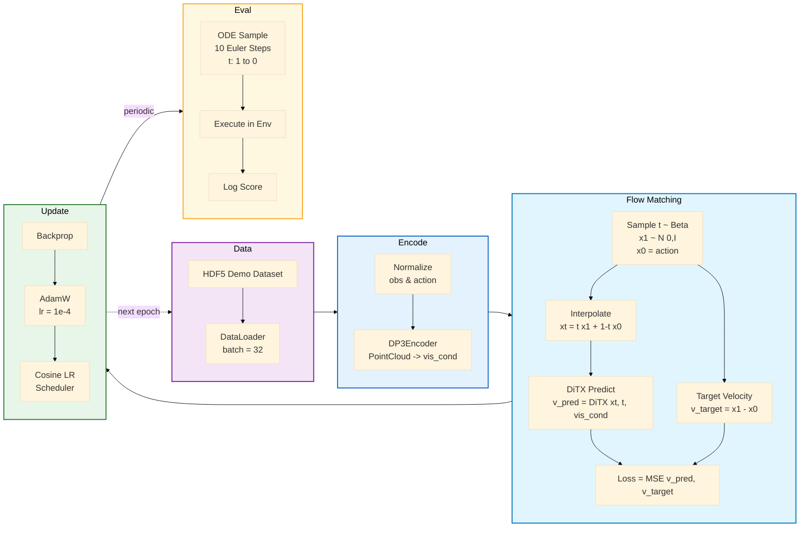

# ManiFlow Pretraining Pipeline

```mermaid
%%{init: {'theme': 'base', 'themeVariables': {'fontSize': '18px', 'fontFamily': 'Helvetica'}}}%%
flowchart LR
    subgraph DATA[" Data "]
        direction TB
        A1["HDF5 Demo Dataset"]
        A2["DataLoader<br/>batch = 32"]
        A1 --> A2
    end

    subgraph ENCODE[" Encode "]
        direction TB
        B1["Normalize<br/>obs & action"]
        B2["DP3Encoder<br/>PointCloud -> vis_cond"]
        B1 --> B2
    end

    subgraph FLOW[" Flow Matching "]
        direction TB
        F1["Sample t ~ Beta<br/>x1 ~ N 0,I<br/>x0 = action"]
        F2["Interpolate<br/>xt = t x1 + 1-t x0"]
        F3["DiTX Predict<br/>v_pred = DiTX xt, t, vis_cond"]
        F4["Target Velocity<br/>v_target = x1 - x0"]
        F5["Loss = MSE v_pred, v_target"]
        F1 --> F2 --> F3 --> F5
        F1 --> F4 --> F5
    end

    subgraph UPDATE[" Update "]
        direction TB
        O1["Backprop"]
        O2["AdamW<br/>lr = 1e-4"]
        O3["Cosine LR<br/>Scheduler"]
        O1 --> O2 --> O3
    end

    subgraph EVAL[" Eval "]
        direction TB
        E1["ODE Sample<br/>10 Euler Steps<br/>t: 1 to 0"]
        E2["Execute in Env"]
        E3["Log Score"]
        E1 --> E2 --> E3
    end

    DATA --> ENCODE --> FLOW --> UPDATE
    UPDATE -.->|"next epoch"| DATA
    UPDATE -->|"periodic"| EVAL

    style DATA fill:#f3e5f5,stroke:#7b1fa2,stroke-width:2px,color:#000
    style ENCODE fill:#e3f2fd,stroke:#1565c0,stroke-width:2px,color:#000
    style FLOW fill:#e1f5fe,stroke:#0277bd,stroke-width:2px,color:#000
    style UPDATE fill:#e8f5e9,stroke:#2e7d32,stroke-width:2px,color:#000
    style EVAL fill:#fff8e1,stroke:#f9a825,stroke-width:2px,color:#000
```
