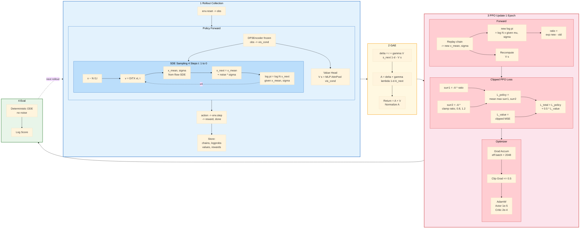

# ManiFlow RL Training Pipeline (Gaussian PPO)

```mermaid
%%{init: {'theme': 'base', 'themeVariables': {'fontSize': '18px', 'fontFamily': 'Helvetica'}}}%%
flowchart LR
    subgraph COLLECT[" 1 Rollout Collection "]
        direction TB

        C1["env.reset -> obs"]

        subgraph POLICY[" Policy Forward "]
            direction TB
            P1["DP3Encoder frozen<br/>obs -> vis_cond"]
            P2["Value Head<br/>V s = MLP AttnPool vis_cond"]

            subgraph SDE[" SDE Sampling 4 Steps t: 1 to 0 "]
                direction LR
                D1["x ~ N 0,I"]
                D2["v = DiTX xt, t"]
                D3["x_mean, sigma<br/>from flow-SDE"]
                D4["x_next = x_mean<br/>+ noise * sigma"]
                D5["log pi = log N x_next<br/>given x_mean, sigma"]
                D1 --> D2 --> D3 --> D4 --> D5
                D5 -.->|"x4"| D2
            end

            P1 --> P2
            P1 --> SDE
        end

        C1 --> POLICY
        C2["action -> env.step<br/>-> reward, done"]
        C3["Store:<br/>chains, logprobs<br/>values, rewards"]
        POLICY --> C2 --> C3
    end

    subgraph GAE[" 2 GAE "]
        direction TB
        G1["delta = r + gamma V s_next 1-d - V s"]
        G2["A = delta + gamma lambda 1-d A_next"]
        G3["Return = A + V<br/>Normalize A"]
        G1 --> G2 --> G3
    end

    subgraph PPO[" 3 PPO Update 1 Epoch "]
        direction TB

        subgraph FWD[" Forward "]
            direction LR
            F1["Replay chain<br/>-> new x_mean, sigma"]
            F2["new log pi<br/>= log N x given mu, sigma"]
            F3["ratio =<br/>exp new - old"]
            F4["Recompute<br/>V s"]
            F1 --> F2 --> F3
            F1 --> F4
        end

        subgraph LOSS[" Clipped PPO Loss "]
            direction LR
            L1["surr1 = -A * ratio"]
            L2["surr2 = -A *<br/>clamp ratio, 0.8, 1.2"]
            L3["L_policy =<br/>mean max surr1, surr2"]
            L4["L_value =<br/>clipped MSE"]
            L5["L_total = L_policy<br/>+ 0.5 * L_value"]
            L1 --> L3
            L2 --> L3
            L3 --> L5
            L4 --> L5
        end

        subgraph UPD[" Optimizer "]
            direction TB
            U1["Grad Accum<br/>eff batch = 2048"]
            U2["Clip Grad <= 0.5"]
            U3["AdamW<br/>Actor 1e-5<br/>Critic 2e-4"]
            U1 --> U2 --> U3
        end

        FWD --> LOSS --> UPD
    end

    subgraph EV[" 4 Eval "]
        direction TB
        EV1["Deterministic ODE<br/>no noise"]
        EV2["Log Score"]
        EV1 --> EV2
    end

    COLLECT --> GAE --> PPO --> EV
    EV -.->|"next rollout"| COLLECT

    style COLLECT fill:#e3f2fd,stroke:#1565c0,stroke-width:2px,color:#000
    style GAE fill:#fff8e1,stroke:#f9a825,stroke-width:2px,color:#000
    style PPO fill:#fce4ec,stroke:#c62828,stroke-width:2px,color:#000
    style EV fill:#e8f5e9,stroke:#2e7d32,stroke-width:2px,color:#000
    style SDE fill:#bbdefb,stroke:#1565c0,stroke-width:1px,color:#000
    style POLICY fill:#e3f2fd,stroke:#1565c0,stroke-width:1px,color:#000
    style FWD fill:#ffcdd2,stroke:#c62828,stroke-width:1px,color:#000
    style LOSS fill:#ffcdd2,stroke:#c62828,stroke-width:1px,color:#000
    style UPD fill:#ffcdd2,stroke:#c62828,stroke-width:1px,color:#000
```
